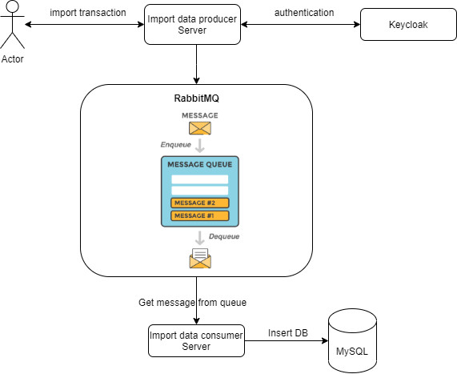

# Bank-Reconciliation-System
Bank ABC wants the back office import the transactions to our system.
- Help ABC bank import data into our system.
- The system import Excel/CSV file that can have more than 1 million records.
- The system provides API for clients to call via HTTP(s) protocol to import the transactions.
- Provide user authentication with tokens.
## System requirements
- NodeJs: NestJs Framework
- Docker: Mysql, Keycloak, RabbitMQ

## System architecture


## Directory structure

- `import-data-producer`: The source code API receives the request from the Client, sends the message to RabbitMQ.
- `import-data-consumer`: The source code receives the message from the queue and processes the MySQL insert.
 
## Run source

- Copy the file `.env.example` to the file `.env` in the directories `import-data-producer`, `import-data-consumer`
- In the root directory of the project. Type the command `docker-compose up -d --build`..
- In the `import-data-producer` directory. Run the command `npm run start`.
- In the `import-data-consumer` folder. Run the command `npm run start`.

## Run test

- In the `import-data-producer` directory. Run the command `npm test`.
- In the `import-data-consumer` folder. Run the command `npm test`.

## Create a user account on Keycloak

- [Click to view the instruction file](Guideline_createuser_keycloak.docx)

## Get tokens through keycloak's api

```
curl --location --request POST 'http://localhost:8080/auth/realms/demo/protocol/openid-connect/token' \
--header 'Content-Type: application/x-www-form-urlencoded' \
--data-urlencode 'client_id=import-transaction' \
--data-urlencode 'grant_type=password' \
--data-urlencode 'client_secret=528d44ee-56a3-48b8-be0f-0b386d9f8c8c' \
--data-urlencode 'scope=openid' \
--data-urlencode 'username={{username of user}}' \
--data-urlencode 'password={{password of user}}'
```
Note:
- `{{username of user}}`: Replace it with the username of the user created in the above step.
- `{{password of user}}`: Replace it with the password of the user created in the above step.


## API Import transaction
```
curl --location --request POST 'localhost:3000/import-transaction/upload' \
--header 'Authorization: Bearer {{token của user}}' \
--form 'file=@"{{file's absolute path}}"'
```

Note:
- `{{token of user}}`: User's token is obtained in the above step
- `{{file's absolute path}}`: Absolute path of the file to import.
- Template file: [csv](./data.csv), [excel](./data.xlsx)
